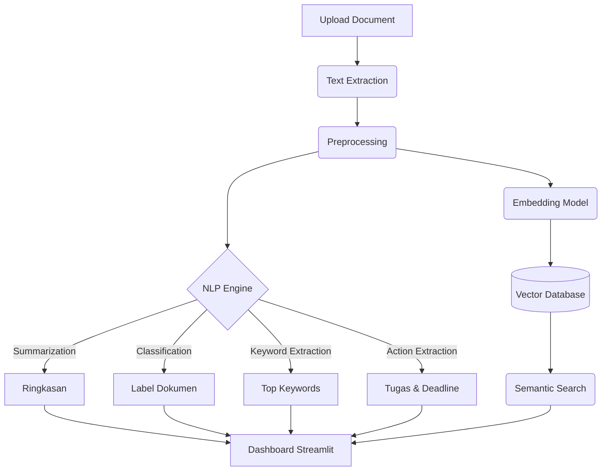

# AI-Powered Document Intelligence System


Sistem cerdas berbasis AI untuk pemahaman semantik dan otomatisasi tugas dari dokumen. Sistem ini menggunakan teknologi NLP terkini untuk melakukan ekstraksi informasi, ringkasan, klasifikasi, pencarian semantik, dan deteksi "Action Item" dari berbagai jenis dokumen (PDF, DOCX, dll).

## 🌟 Fitur Utama

1. **Multi-Format Document Parsing**: Ekstraksi teks otomatis dari berbagai format file (PDF, Microsoft Word `.docx`, dan `.txt`) secara lokal maupun unggahan.
2. **Summarization**: Membuat ringkasan dokumen panjang menjadi paragraf pendek atau *bullet points* menggunakan model IndoBERT/mT5.
3. **Document Classification**: Mengklasifikasikan dokumen secara otomatis (Laporan, Surat Resmi, Invoice, Berita) menggunakan model *Zero-Shot* mDeBERTa beserta indikator skor Akurasi (Confidence).
4. **Keyword Extraction**: Mengekstrak kata kunci utama dari sebuah dokumen menggunakan KeyBERT/TF-IDF.
5. **Semantic Search & Custom Indexing**: Mencari dokumen berdasarkan makna menggunakan ChromaDB dan Sentence-Transformers. Mendukung pencarian folder lokal/Google Drive Desktop (*Browse Folder* interaktif) secara rekursif.
6. **Action Item Extraction**: Mengekstrak tugas, tenggat waktu (*deadline*), dan penanggung jawab dari dokumen.
7. **Dashboard Interaktif & Progresif**: Antarmuka Streamlit yang responsif, dilengkapi animasi *loading CSS*, *progress bar* detail per tahapan NLP, dan penguncian tombol pintar.
8. **Pipeline Evaluasi & Pemodelan**: Dilengkapi skrip *Jupyter Notebook* terpisah untuk memantau performa model (*Accuracy*, *F1-Score*, *Confusion Matrix*) dan landasan untuk *Fine-Tuning* IndoBERT.

## 🏗️ Arsitektur Sistem



## 📂 Struktur Direktori

```text
capstone/
├── data/
│   ├── raw/               # Dataset mentah
│   ├── processed/         # Dataset yang sudah dibersihkan
│   └── synthetic/         # Dataset buatan (LLM generated)
├── models/                # Weights model NLP yang telah di-train
├── src/
│   ├── api/               # Endpoint FastAPI
│   ├── core/              # Logika NLP (Summarization, Classification, dll)
│   └── utils/             # Script pendukung (Preprocessing, Document Parser)
├── dashboard/             # Antarmuka web Streamlit
├── notebooks/             # Eksperimen Jupyter Notebook (EDA, Evaluasi)
├── requirements.txt       # Dependencies Python
├── .env                   # Environment variables
└── README.md              # Dokumentasi proyek
```

## 🚀 Panduan Langkah demi Langkah (Step-by-Step)

Untuk menjalankan proyek ini dari awal (terutama pada instalasi baru), ikuti urutan berikut secara teliti:

### 1. Instalasi Environment & Dependensi
Pastikan Anda berada di direktori proyek (`c:\xampp\htdocs\capstone`), lalu jalankan instalasi *library* inti beserta pustaka pengolahan citra yang sering diminta oleh `transformers`:
```bash
pip install -r requirements.txt
pip install torchvision  # Diperlukan oleh HuggingFace Pipeline
```

### 2. Pengolahan Dataset (Dataset Generation)
Sebelum UI bisa menampilkan opsi dokumen, Anda harus men-*generate* dataset sintetik. Buka terminal dan jalankan:
```bash
python src/utils/data_generator.py
```
> **Apa yang terjadi di tahap ini?** Script akan mengotomatiskan pembuatan 50 buah dokumen dummy (Laporan, Surat, Invoice, Berita) yang diacak menggunakan template. Hasilnya akan disimpan dalam bentuk JSON dan TXT di folder `data/synthetic/`.

### 3. Menjalankan Dashboard UI Streamlit
Setelah data berhasil dibuat, luncurkan antarmuka web dengan:
```bash
streamlit run dashboard/app.py
```

### 4. Menggunakan Fitur di dalam Dashboard
1. Buka browser yang diarahkan ke `http://localhost:8501`. Saat pertama kali dibuka, Anda akan melihat layar animasi inisialisasi AI Engine yang sedang memuat ratusan MB model ke memori.
2. Di **Sidebar**, pilih **Analisis Dokumen** lalu gunakan metode input **Upload File (PDF/DOCX/TXT)** untuk mengunggah dokumen dari PC Anda, atau gunakan *Pilih dari Dataset Sintetik*.
3. Klik **Analisis Sekarang** untuk memproses AI. *Progress bar* akan menunjukkan setiap tahapan proses NLP (Ringkasan, Ekstraksi Tugas, Klasifikasi) hingga selesai.
4. Pindah ke menu **Pencarian Semantik (Vector DB)** di Sidebar.
5. **PENTING (Indexing Data):** 
   - Anda bisa menekan tombol **Index Ulang Dataset Sintetik** untuk memuat data dummy.
   - ATAU gunakan fitur **Index dari Folder Custom**. Klik tombol **"📂 Browse..."** untuk memilih folder mana saja di komputer Anda (atau folder Google Drive Desktop). AI akan menelusuri folder beserta semua *subfolder* di dalamnya secara otomatis untuk membaca seluruh file PDF/Word/TXT dan mengubahnya menjadi vektor pencarian.
6. Ketikkan pertanyaan alami (misal: "Kapan jadwal cuti bersama?"), lalu klik tombol **Cari Dokumen** untuk menguji kekuatan Semantic Search.

## 📊 Strategi Evaluasi

Sistem ini dievaluasi secara ketat untuk memastikan performa *production-ready*:
- **Summarization**: Evaluasi menggunakan skor **ROUGE**.
- **Classification**: Evaluasi menggunakan **Accuracy, F1-Score, dan Confusion Matrix**. Kami juga melakukan *Comparative Study* antara metode BERT dan BiLSTM.
- **Semantic Search**: Evaluasi kualitas pencarian menggunakan **Precision@K**.

## 👥 Pengembang
- **Nama/Tim**: PJK-GU104
- **Institusi**: PIJAK 2026
