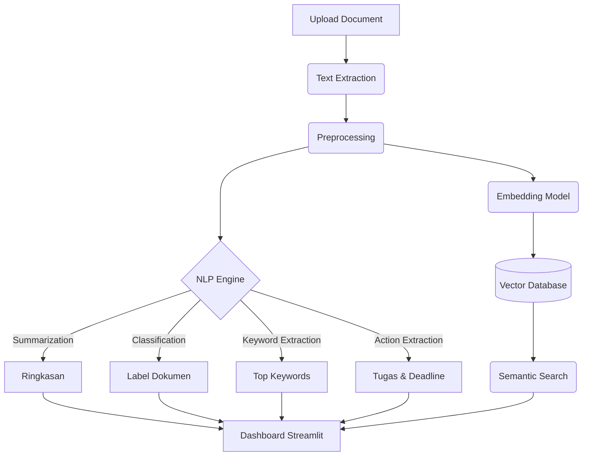

# AI-Powered Document Intelligence System


Sistem cerdas berbasis AI untuk pemahaman semantik dan otomatisasi tugas dari dokumen. Sistem ini menggunakan teknologi NLP terkini untuk melakukan ekstraksi informasi, ringkasan, klasifikasi, pencarian semantik, dan deteksi "Action Item" dari berbagai jenis dokumen (PDF, DOCX, dll).

## 🌟 Fitur Utama

1. **Multi-Format Document Parsing**: Ekstraksi teks otomatis dari berbagai format file (PDF, Microsoft Word `.docx`, dan `.txt`) secara lokal maupun unggahan.
2. **Summarization**: Membuat ringkasan dokumen panjang secara otomatis atau format _bullet points_ dengan model seq2seq **mT5** (`csebuetnlp/mT5_multilingual_XLSum`).
3. **Document Classification**: Mengklasifikasikan dokumen secara otomatis ke dalam kategori dinamis (Laporan, Surat Resmi, Invoice, Berita, dll) menggunakan model _Zero-Shot_ **mDeBERTa-v3** beserta indikator tingkat keyakinan (Confidence Score).
4. **Keyword Extraction**: Mengekstrak kata kunci utama dokumen secara otomatis dengan **KeyBERT** menggunakan model embedding multibahasa.
5. **Semantic Search & Custom Indexing**: Pencarian dokumen berbasis makna menggunakan **ChromaDB** (Vector Database) dan **Sentence-Transformers**. Mendukung pembacaan & pengindeksan massal dari folder lokal secara rekursif.
6. **Chat dengan Dokumen (Q&A)**: Bertanya jawab secara cerdas dengan isi dokumen secara lokal dengan model **IndoBERT-QA** (`Rifky/Indobert-QA`) atau secara generatif menggunakan **OpenAI GPT-3.5 API**.
7. **Action Item Extraction**: Mengekstrak poin penugasan, nama penanggung jawab (PIC), dan tenggat waktu (_deadline_) dari isi teks dokumen secara otomatis.
8. **Dashboard Interaktif**: Antarmuka web modern berbasis **Streamlit** yang dilengkapi dengan visualisasi matriks, loading progress bar interaktif, dan kontrol navigasi.
9. **Pipeline Evaluasi & Pemodelan**: Dilengkapi skrip Jupyter Notebook untuk visualisasi performa model (_Accuracy, F1-Score, Confusion Matrix_) dan sebagai blueprint untuk _Fine-Tuning_ IndoBERT.

## 🏗️ Arsitektur Sistem



## 📂 Struktur Direktori

```text
capstone/
├── data/
│   ├── raw/               # Dataset mentah
│   ├── processed/         # Dataset yang sudah dibersihkan
│   └── synthetic/         # Dataset buatan (LLM generated)
├── models/                # Weights model NLP yang telah di-train
├── src/
│   ├── api/               # Endpoint FastAPI
│   ├── core/              # Logika NLP (Summarization, Classification, dll)
│   └── utils/             # Script pendukung (Preprocessing, Document Parser)
├── notebooks/             # Eksperimen Jupyter Notebook (EDA, Evaluasi)
├── requirements.txt       # Dependencies Python
├── .env                   # Environment variables
├── .gitignore             # File Git ignore
├── app.py                 # Antarmuka web Streamlit (HF Space ready)
└── README.md              # Dokumentasi proyek
```

## ⚙️ Konfigurasi Environment (`.env`)

Sistem ini didesain agar mudah diubah model AI-nya tanpa mengubah kode program utama. Anda dapat mengatur model-model yang digunakan melalui file `.env`:

```env
# Model Configurations
SUMMARIZATION_MODEL=csebuetnlp/mT5_multilingual_XLSum        # Model Peringkas (mT5)
CLASSIFIER_MODEL=MoritzLaurer/mDeBERTa-v3-base-mnli-xnli     # Model Klasifikasi Zero-Shot (mDeBERTa)
QA_MODEL=Rifky/Indobert-QA                                   # Model Tanya Jawab Lokal (IndoBERT-QA)
EMBEDDING_MODEL=sentence-transformers/paraphrase-multilingual-MiniLM-L12-v2 # Model Vektor (Semantic Search)
```

## 🚀 Panduan Langkah demi Langkah (Step-by-Step)

Untuk menjalankan proyek ini dari awal (terutama pada instalasi baru), ikuti urutan berikut secara teliti:

### 1. Instalasi Environment & Dependensi

Pastikan Anda berada di direktori proyek (`c:\xampp\htdocs\capstone`), lalu jalankan instalasi _library_ inti beserta pustaka pengolahan citra yang sering diminta oleh `transformers`:

```bash
pip install -r requirements.txt
pip install torchvision  # Diperlukan oleh HuggingFace Pipeline
```

### 2. Pengolahan Dataset (Dataset Generation)

Sebelum UI bisa menampilkan opsi dokumen, Anda harus men-_generate_ dataset sintetik. Buka terminal dan jalankan:

```bash
python src/utils/data_generator.py
```

> **Apa yang terjadi di tahap ini?** Script akan mengotomatiskan pembuatan 50 buah dokumen dummy (Laporan, Surat, Invoice, Berita) yang diacak menggunakan template. Hasilnya akan disimpan dalam bentuk JSON dan TXT di folder `data/synthetic/`.

### 3. Menjalankan Dashboard UI Streamlit

Setelah data berhasil dibuat, luncurkan antarmuka web dengan:

```bash
streamlit run app.py
```

### 4. Menggunakan Fitur di dalam Dashboard

1. Buka browser yang diarahkan ke `http://localhost:8501`. Saat pertama kali dibuka, Anda akan melihat layar animasi inisialisasi AI Engine yang sedang memuat ratusan MB model ke memori.
2. Di **Sidebar**, pilih **Analisis Dokumen** lalu gunakan metode input **Upload File (PDF/DOCX/TXT)** untuk mengunggah dokumen dari PC Anda, atau gunakan _Pilih dari Dataset Sintetik_.
3. Klik **Analisis Sekarang** untuk memproses AI. _Progress bar_ akan menunjukkan setiap tahapan proses NLP (Ringkasan, Ekstraksi Tugas, Klasifikasi) hingga selesai.
4. Pindah ke menu **Pencarian Semantik (Vector DB)** di Sidebar.
5. **PENTING (Indexing Data):**
   - Anda bisa menekan tombol **Index Ulang Dataset Sintetik** untuk memuat data dummy.
   - ATAU gunakan fitur **Index dari Folder Custom**. Klik tombol **"📂 Browse..."** untuk memilih folder mana saja di komputer Anda (atau folder Google Drive Desktop). AI akan menelusuri folder beserta semua _subfolder_ di dalamnya secara otomatis untuk membaca seluruh file PDF/Word/TXT dan mengubahnya menjadi vektor pencarian.
6. Ketikkan pertanyaan alami (misal: "Kapan jadwal cuti bersama?"), lalu klik tombol **Cari Dokumen** untuk menguji kekuatan Semantic Search.

## 📊 Strategi Evaluasi

Sistem ini dievaluasi secara ketat untuk memastikan performa _production-ready_:

- **Summarization**: Evaluasi menggunakan skor **ROUGE**.
- **Classification**: Evaluasi menggunakan **Accuracy, F1-Score, dan Confusion Matrix**. Kami juga melakukan _Comparative Study_ antara metode BERT dan BiLSTM.
- **Semantic Search**: Evaluasi kualitas pencarian menggunakan **Precision@K**.

## ☁️ Deployment ke Hugging Face Spaces

Project ini sudah siap (**Hugging Face Spaces Ready**) dengan tersedianya file [app.py](file:///c:/xampp/htdocs/capstone/app.py) di root directory dan penanganan khusus untuk server headless cloud (seperti pengamanan modul browser Tkinter folder).

### Langkah-langkah Deployment:

1. Buat Space baru di [Hugging Face Spaces](https://huggingface.co/new-space) dengan SDK **Streamlit** dan hardware **CPU basic (Free)**.
2. Clone repositori Space baru Anda ke lokal.
3. Salin seluruh isi direktori ini (kecuali `.git` dan `.env`) ke dalam folder repositori hasil clone tersebut. Pastikan file `app.py` dan `requirements.txt` berada di root folder.
4. Buka tab **Settings** di halaman Space Hugging Face Anda, gulir ke bagian **Variables and secrets**, lalu daftarkan variabel model di bawah ini sebagai **Variables**:
   - `SUMMARIZATION_MODEL` = `csebuetnlp/mT5_multilingual_XLSum`
   - `CLASSIFIER_MODEL` = `MoritzLaurer/mDeBERTa-v3-base-mnli-xnli`
   - `QA_MODEL` = `Rifky/Indobert-QA`
   - `EMBEDDING_MODEL` = `sentence-transformers/paraphrase-multilingual-MiniLM-L12-v2`
5. Lakukan git push kode Anda ke server Hugging Face:
   ```bash
   git add .
   git commit -m "Deploy to Hugging Face Space"
   git push
   ```
6. Hugging Face akan membangun dan menjalankan aplikasi Anda secara otomatis di cloud!

## 👥 Pengembang

- **Nama/Tim**: PJK-GU104
- **Institusi**: PIJAK 2026
